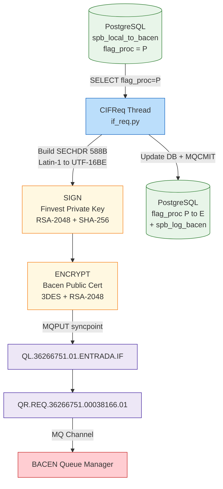
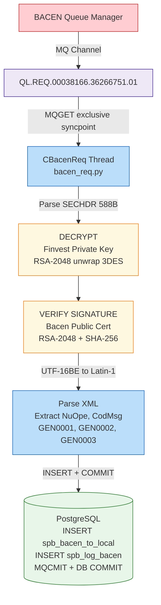
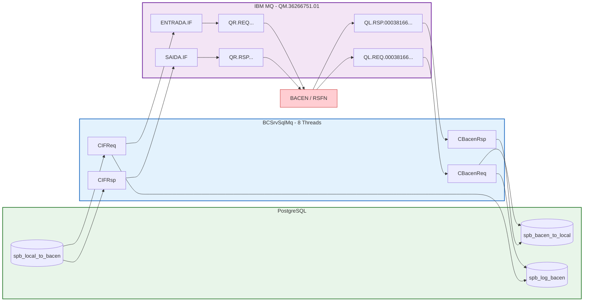
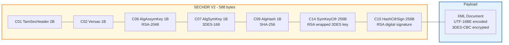

# BCSrvSqlMq - Message Flows

## Overview

BCSrvSqlMq has 8 worker threads split into two directions:

| Direction | Threads | Flow |
|-----------|---------|------|
| **IF -> Bacen** (Outbound) | CIFReq, CIFRsp, CIFRep, CIFSup | DB -> MQ |
| **Bacen -> IF** (Inbound)  | CBacenReq, CBacenRsp, CBacenRep, CBacenSup | MQ -> DB |

---

## Certificate Usage

| Key / Certificate | File | Usage |
|-------------------|------|-------|
| **Finvest Private Key** | `finvest_sim.key` (sim) / `private.key` (prod) | Sign outbound msgs (`func_assinar`) / Decrypt inbound msgs (`func_de_cript`) |
| **Bacen Public Certificate** | `bacen_sim.cer` (sim) / `Bacen.cer` (prod) | Encrypt outbound msgs (`func_cript`) / Verify inbound signatures (`func_verify_ass`) |

INI mapping:
- `privatekeyfile` = Finvest private key
- `certificatefile` = Bacen public certificate

---

## Security Protocol Versions

| Version | SECHDR Size | RSA | Hash | Symmetric | Status |
|---------|-------------|-----|------|-----------|--------|
| **V1** (Versao=0x01) | 332 bytes | RSA-1024 | MD5/SHA-1 | 3DES-168 | Legacy (2001-2024) |
| **V2** (Versao=0x02) | 588 bytes | RSA-2048 | SHA-256 | 3DES-168 | **Current** (2024+) |

Per Manual de Seguranca do SFN v5 (BACEN 2024 update).

---

## Flow 1: IF -> Bacen (Outbound)



### Outbound Steps:
1. Poll DB for pending records (`flag_proc='P'`)
2. Read XML message from `spb_local_to_bacen.msg` column
3. Build Security Header (SECHDR V2, 588 bytes)
4. Convert XML: Latin-1 -> UTF-16BE (byte swap)
5. **Sign** payload with **Finvest private key** (RSA-2048 + SHA-256)
6. **Encrypt** payload with **Bacen public certificate** (3DES + RSA-2048 key wrap)
7. MQPUT `SECHDR + encrypted_payload` under syncpoint
8. Update app record `flag_proc = 'P' -> 'E'`
9. Insert log record in `spb_log_bacen`
10. MQCMIT + DB COMMIT (atomic)

---

## Flow 2: Bacen -> IF (Inbound)



### Inbound Steps:
1. MQGET from `QL.REQ.00038166.36266751.01` (exclusive, syncpoint, wait)
2. Parse Security Header (auto-detect V1 332 bytes or V2 588 bytes)
3. **Decrypt** payload with **Finvest private key** (RSA-2048 unwrap 3DES key, then 3DES-CBC)
4. **Verify signature** with **Bacen public certificate** (RSA-2048 + SHA-256)
5. Decode XML: UTF-16BE -> Latin-1
6. Parse XML to extract NuOpe, CodMsg, Emissor, Destinatario
7. Handle special messages (GEN0001 Echo, GEN0002 Log, GEN0003 UltMsg)
8. INSERT message into `spb_bacen_to_local`
9. INSERT audit record into `spb_log_bacen`
10. MQCMIT + DB COMMIT (atomic)

---

## Complete Architecture



---

## Security Detail -- Message Envelope V2



### V1 vs V2 Header Comparison

| Field | V1 (332 bytes) | V2 (588 bytes) |
|-------|---------------|---------------|
| C01 TamSecHeader | 0x014C (332) | 0x024C (588) |
| C02 Versao | 0x01 | 0x02 |
| C04-C05 | Reservado (2B) | TratamentoEspecial (1B) + Reservado (1B) |
| C06 AlgAssymKey | 0x01 (RSA-1024) | 0x02 (RSA-2048) |
| C09 AlgHash | 0x01 (MD5) / 0x02 (SHA-1) | 0x03 (SHA-256) |
| C14 SymKeyCifr | 1+127 = 128 bytes | 256 bytes |
| C15 HashCifrSign | 1+127 = 128 bytes | 256 bytes |

The inbound handler auto-detects V1/V2 from the first 2 bytes (TamSecHeader).

---

## Bacen Simulator

The Bacen Simulator (`python/scripts/bacen_simulator.py`) acts as the Central Bank side for local testing. It runs on the **same queue manager** and uses simulation certificates to exchange messages with the Finvest server.

### Simulator Architecture

```mermaid
graph LR
    IF_REQ["CIFReq<br/>outbound DB to MQ"]
    QL_IF["QL...ENTRADA.IF"]
    SIM_RCV["Simulator<br/>Receive + Decrypt"]
    SIM_SND["Simulator<br/>Sign + Encrypt"]
    QL_BC["QL.RSP.00038166..."]
    BC_RSP["CBacenRsp<br/>inbound MQ to DB"]

    IF_REQ -->|"sign finvest_sim.key<br/>encrypt bacen_sim.cer"| QL_IF
    QL_IF -->|"MQGET"| SIM_RCV
    SIM_RCV -->|"decrypt bacen_sim.key<br/>verify finvest_sim.cer"| SIM_SND
    SIM_SND -->|"sign bacen_sim.key<br/>encrypt finvest_sim.cer"| QL_BC
    QL_BC -->|"MQGET"| BC_RSP

    style IF_REQ fill:#bbdefb,stroke:#1565c0
    style BC_RSP fill:#bbdefb,stroke:#1565c0
    style QL_IF fill:#ede7f6,stroke:#4527a0
    style QL_BC fill:#ede7f6,stroke:#4527a0
    style SIM_RCV fill:#ffcdd2,stroke:#c62828
    style SIM_SND fill:#ffcdd2,stroke:#c62828
```



### Simulation Certificates

| Certificate | Key Size | Used By | Purpose |
|-------------|----------|---------|---------|
| `finvest_sim.key` | RSA-2048 | Finvest server | Sign outbound / Decrypt inbound |
| `finvest_sim.cer` | RSA-2048 | Bacen simulator | Encrypt to Finvest / Verify Finvest signatures |
| `bacen_sim.key` | RSA-2048 | Bacen simulator | Sign outbound / Decrypt inbound |
| `bacen_sim.cer` | RSA-2048 | Finvest server | Encrypt to Bacen / Verify Bacen signatures |

### Simulator Menu

| Option | Action | Queue | Direction |
|--------|--------|-------|-----------|
| 1. Browse queue depths | Show CURDEPTH of all queues | All | Read-only |
| 2. Receive from Finvest | MQGET + decrypt + verify | `QL.36266751.01.*.IF` | Finvest -> Bacen |
| 3. Send to Finvest | Sign + encrypt + MQPUT | `QL.*.00038166.36266751.01` | Bacen -> Finvest |
| 4. Browse messages | Peek without removing | Any queue | Read-only |

### How to Run

```bash
cd /home/ubuntu/SPBFinal/SPB_FINAL
source venv/bin/activate

# Terminal 1: Finvest server
cd BCSrvSqlMq/python
python -m bcsrvsqlmq -d

# Terminal 2: Bacen auto-responder
cd BCSrvSqlMq
python bacen_auto_responder.py

# Terminal 3: Visual flow monitor (recommended)
python monitor_live.py --inject
```

### End-to-End Test Flow

1. Insert test message in DB (`test_db_insert.py`) -> `spb_local_to_bacen` with `flag_proc='P'`
2. Finvest server picks it up -> signs with `finvest_sim.key` -> encrypts with `bacen_sim.cer` -> MQPUT
3. Bacen simulator receives -> decrypts with `bacen_sim.key` -> verifies with `finvest_sim.cer` -> displays XML
4. Bacen simulator sends response -> signs with `bacen_sim.key` -> encrypts with `finvest_sim.cer` -> MQPUT
5. Finvest server receives -> decrypts with `finvest_sim.key` -> verifies with `bacen_sim.cer` -> INSERT to DB

---

## Queue Naming Convention

| Pattern | Description | Example |
|---------|-------------|---------|
| `QL.{type}.{dest}.{orig}.{seq}` | Local queues (MQGET inbound) | `QL.REQ.00038166.36266751.01` |
| `QR.{type}.{orig}.{dest}.{seq}` | Remote queue defs (MQPUT outbound) | `QR.REQ.36266751.00038166.01` |
| `QL.{ISPB}.{seq}.{stage}.IF` | IF staging queues (local) | `QL.36266751.01.ENTRADA.IF` |

**Types:** REQ (Request), RSP (Response), REP (Report), SUP (Suporte)

---

## 4 Message Types

| Type | Outbound (IF->Bacen) | Inbound (Bacen->IF) |
|------|---------------------|---------------------|
| **REQ** (Request) | CIFReq: DB->MQPUT new requests | CBacenReq: MQGET->DB incoming requests |
| **RSP** (Response) | CIFRsp: DB->MQPUT responses | CBacenRsp: MQGET->DB incoming responses |
| **REP** (Report) | CIFRep: DB->MQPUT delivery reports | CBacenRep: MQGET->DB incoming reports |
| **SUP** (Suporte) | CIFSup: DB->MQPUT support msgs | CBacenSup: MQGET->DB incoming support |
