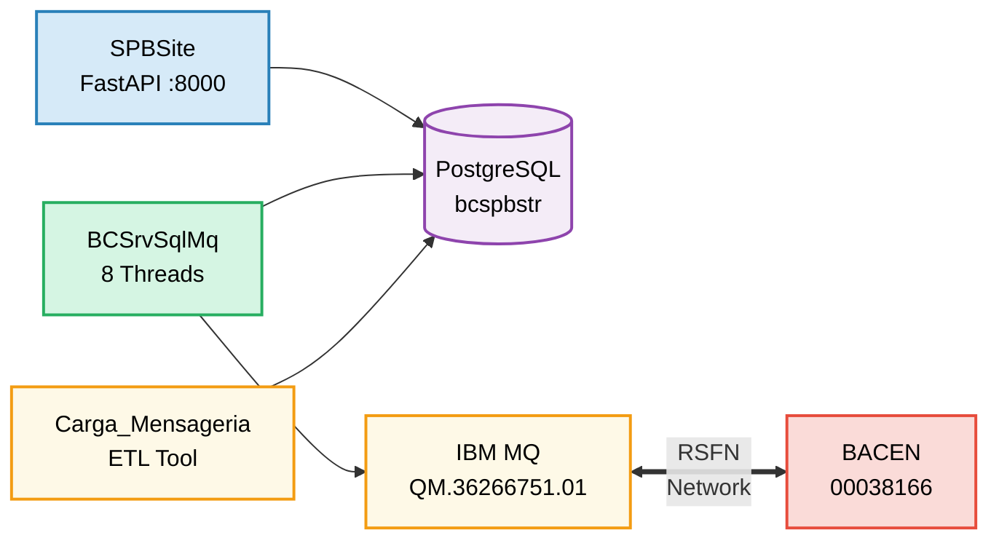
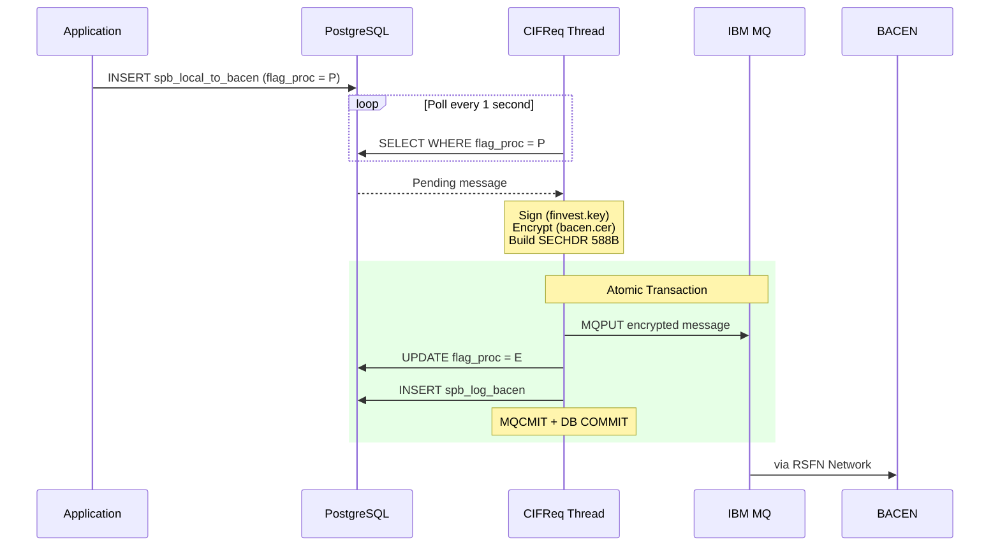
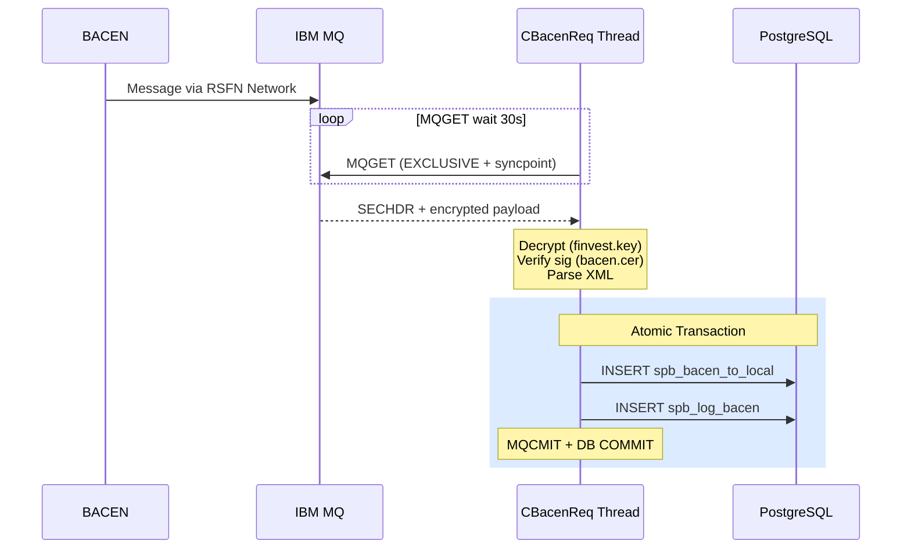
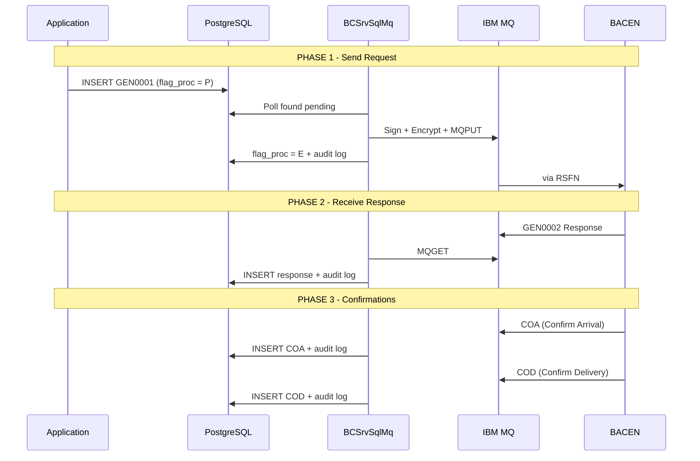
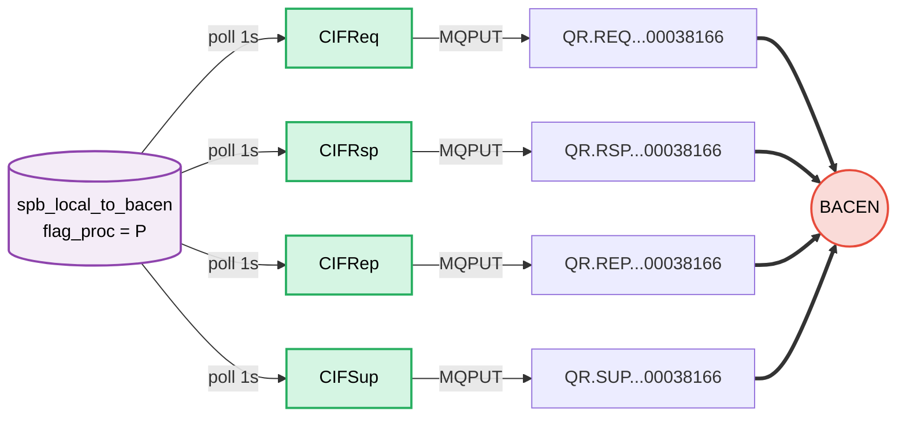
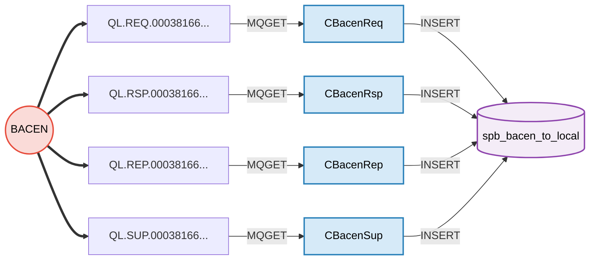
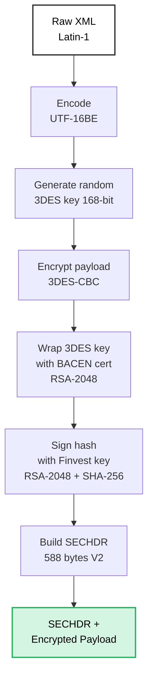
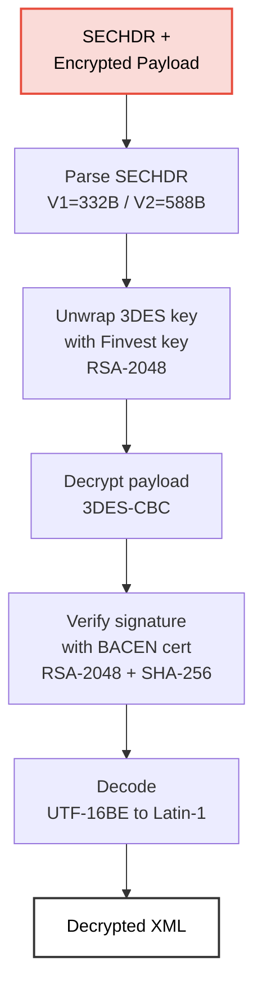
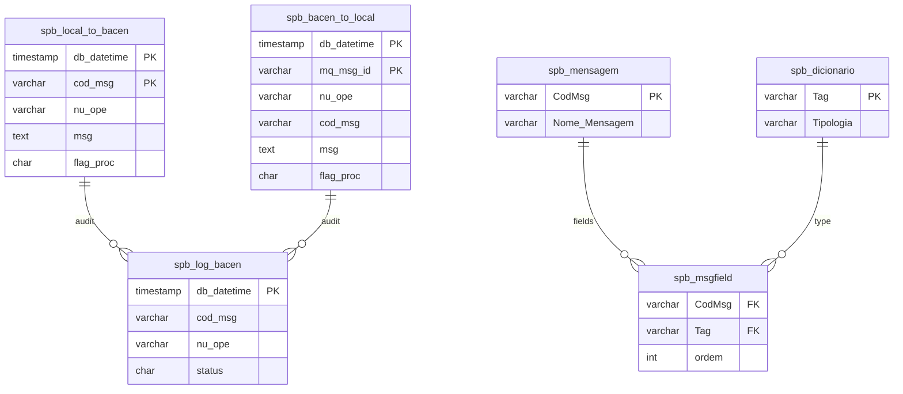
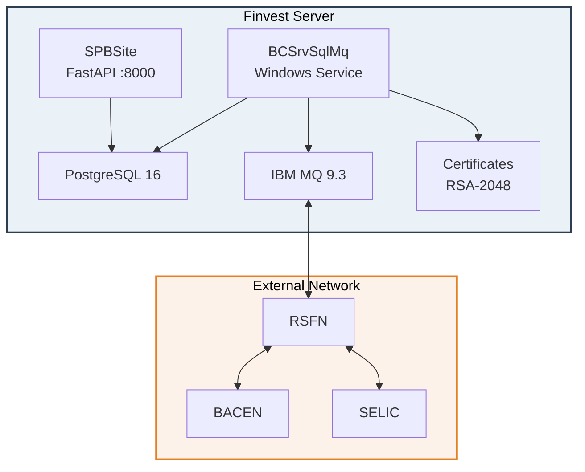

# SPB System - End-to-End Message Flow Diagrams

---

## 1. High-Level Architecture

---

## 2. Outbound Flow: Finvest → BACEN

---

## 3. Inbound Flow: BACEN → Finvest

---

## 4. Complete Request-Response Cycle

---

## 5. Eight Worker Threads

### 5a. Outbound Threads (DB → MQ)

### 5b. Inbound Threads (MQ → DB)

---

## 6. Security - Outbound Encryption

## 7. Security - Inbound Decryption

---

## 8. Database Tables

---

## 9. Deployment View

---

## Queue Reference

| Direction | Type | Queue Name |
|-----------|------|------------|
| **Outbound** | REQ | `QR.REQ.36266751.00038166.01` |
| **Outbound** | RSP | `QR.RSP.36266751.00038166.01` |
| **Outbound** | REP | `QR.REP.36266751.00038166.01` |
| **Outbound** | SUP | `QR.SUP.36266751.00038166.01` |
| **Inbound** | REQ | `QL.REQ.00038166.36266751.01` |
| **Inbound** | RSP | `QL.RSP.00038166.36266751.01` |
| **Inbound** | REP | `QL.REP.00038166.36266751.01` |
| **Inbound** | SUP | `QL.SUP.00038166.36266751.01` |
| **Staging** | IF | `QL.36266751.01.ENTRADA.IF` |
| **Staging** | IF | `QL.36266751.01.SAIDA.IF` |
