# SPB System — Linux Implementation Diagram

---

## 1. High-Level Linux Architecture

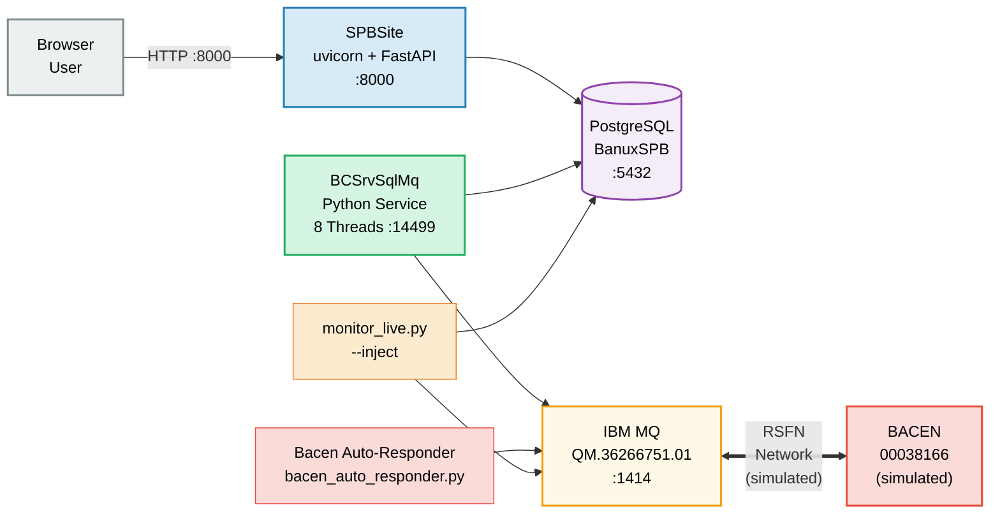

---

## 2. Process Map (What Actually Runs on Linux)

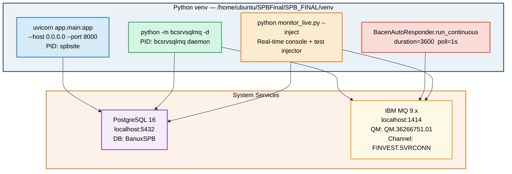

---

## 3. SPBSite — FastAPI Router Map

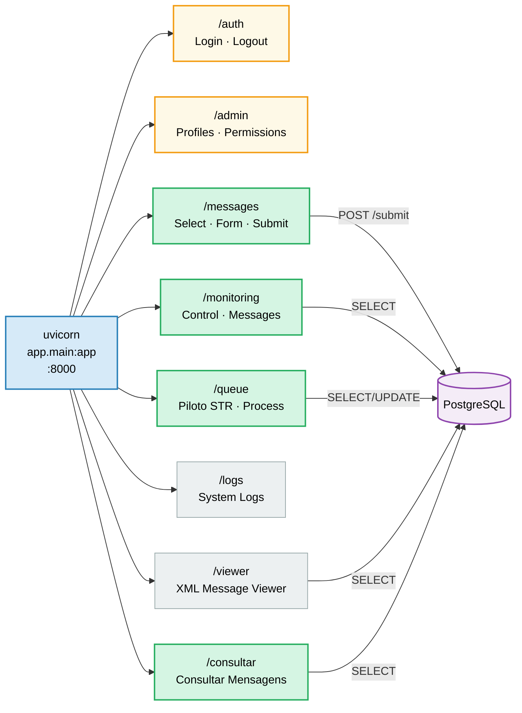

---

## 4. BCSrvSqlMq — Eight Worker Threads (Python)

### 4a. Outbound Threads (DB → MQ → BACEN)

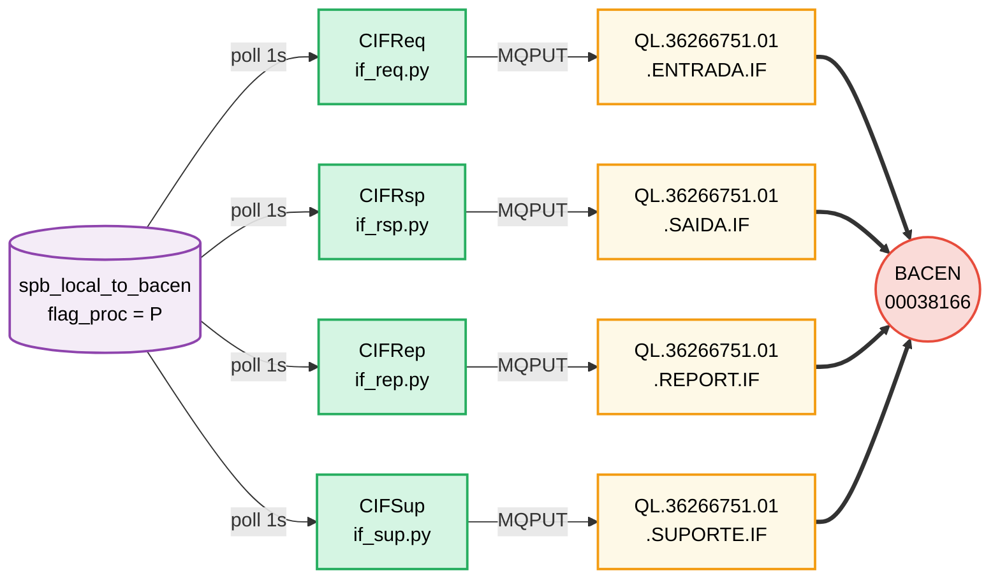

### 4b. Inbound Threads (BACEN → MQ → DB)

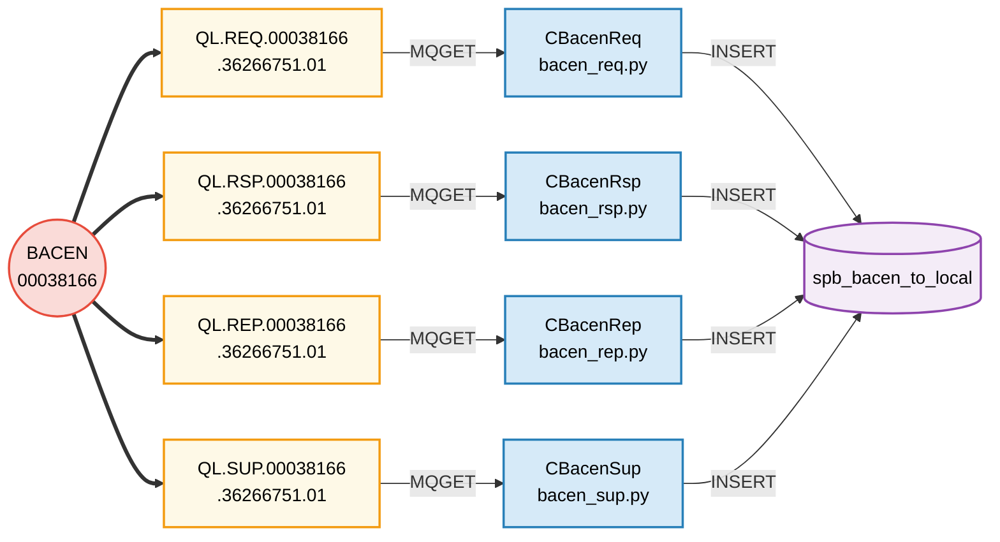

---

## 5. End-to-End Request-Response (Linux Test Loop)

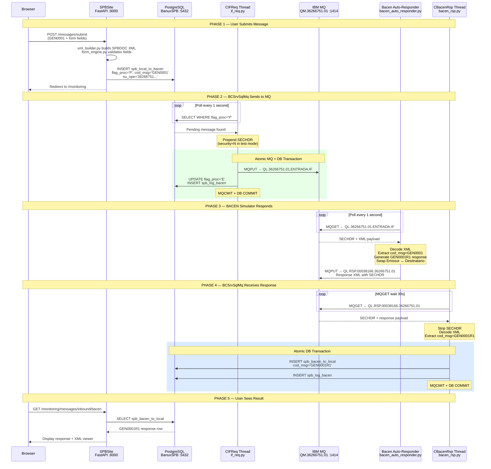

---

## 6. BACEN Auto-Responder Detail (Test Simulator)

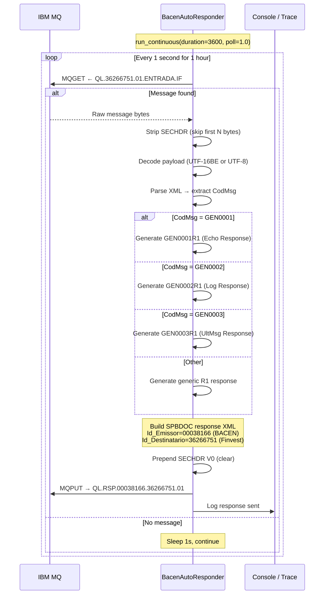

---

## 7. monitor_live.py — Real-Time Event Monitor

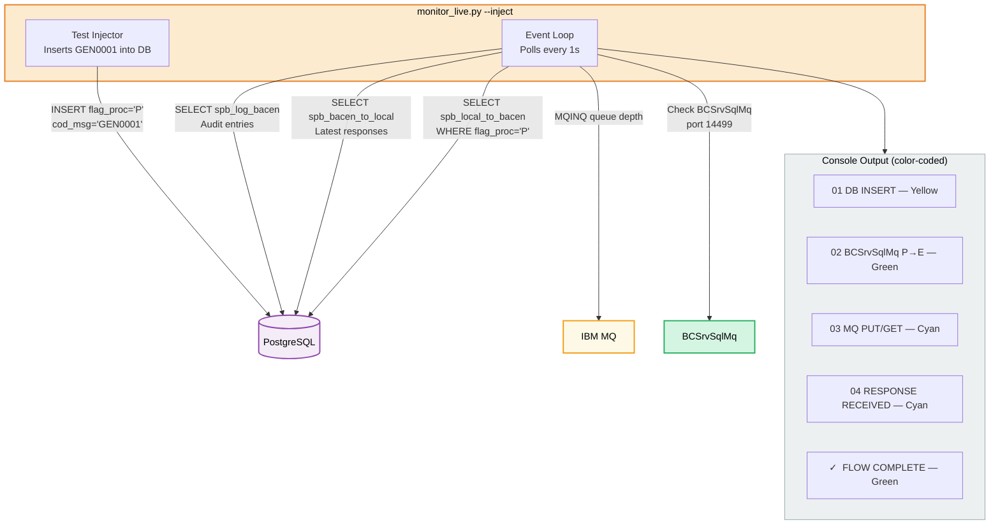

---

## 8. Security Pipeline (When Enabled)

```mermaid
graph TD
    subgraph OUTBOUND["Outbound — Sign + Encrypt"]
        A1["Raw XML\nLatin-1"] --> A2["Encode\nUTF-16BE"]
        A2 --> A3["Generate random\n3DES key 168-bit"]
        A3 --> A4["Encrypt payload\n3DES-CBC"]
        A4 --> A5["Wrap 3DES key\nwith BACEN cert\nRSA-2048"]
        A5 --> A6["Sign hash\nwith Finvest key\nRSA-2048 + SHA-256"]
        A6 --> A7["Build SECHDR\n588 bytes V2"]
        A7 --> A8["SECHDR +\nEncrypted Payload"]
    end

    subgraph INBOUND["Inbound — Verify + Decrypt"]
        B1["SECHDR +\nEncrypted Payload"] --> B2["Parse SECHDR\nV0=clear / V1=332B / V2=588B"]
        B2 --> B3["Unwrap 3DES key\nwith Finvest key\nRSA-2048"]
        B3 --> B4["Decrypt payload\n3DES-CBC"]
        B4 --> B5["Verify signature\nwith BACEN cert\nRSA-2048 + SHA-256"]
        B5 --> B6["Decode\nUTF-16BE → Latin-1"]
        B6 --> B7["Decrypted XML"]
    end

    subgraph CONFIG["BCSrvSqlMq.ini [Security]"]
        C1["securityenable = N  (test)\nsecurityenable = S  (prod)"]
        C2["certificatefile = certificates/bacen_sim.cer\nprivatekeyfile = certificates/finvest_sim.key"]
    end

    CONFIG -.->|controls| OUTBOUND
    CONFIG -.->|controls| INBOUND

    style A1 fill:#fff,stroke:#333,stroke-width:2px,color:#000
    style A8 fill:#d5f5e3,stroke:#27ae60,stroke-width:2px,color:#000
    style B1 fill:#fadbd8,stroke:#e74c3c,stroke-width:2px,color:#000
    style B7 fill:#fff,stroke:#333,stroke-width:2px,color:#000
    style CONFIG fill:#ecf0f1,stroke:#95a5a6,stroke-width:1px,color:#000
```

---

## 9. Database Tables (ER Diagram)

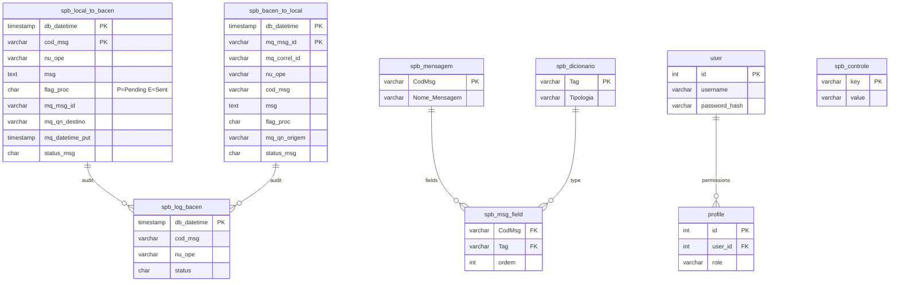

---

## 10. Linux Deployment View

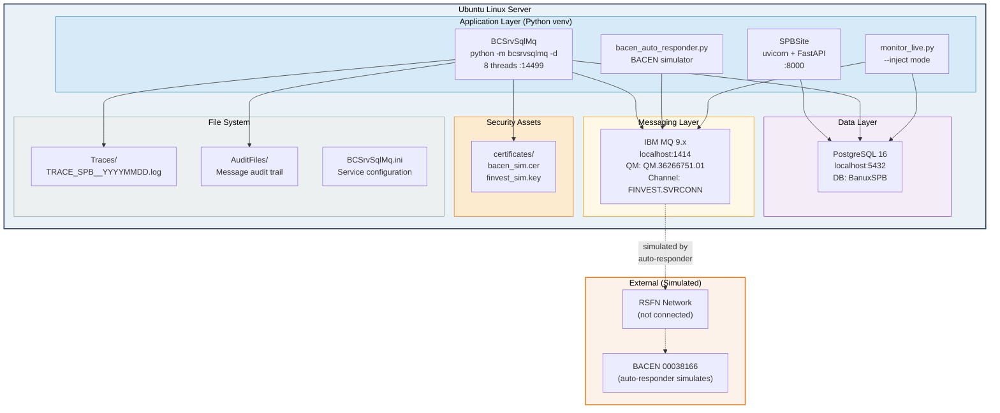

---

## 11. How to Start All Services (Linux)

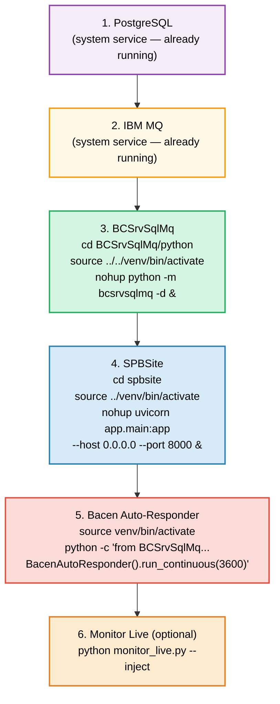

---

## Port & Service Reference

| Service | Port | Protocol | Purpose |
|---------|------|----------|---------|
| **SPBSite** | 8000 | HTTP | FastAPI web application |
| **IBM MQ** | 1414 | MQ TCP | Queue manager (FINVEST.SVRCONN) |
| **PostgreSQL** | 5432 | TCP | Database (BanuxSPB) |
| **BCSrvSqlMq** | 14499 | TCP | Monitoring/health listener |

## Queue Reference

| Direction | Type | Queue Name | Used By |
|-----------|------|------------|---------|
| **Outbound** | IF-REQ | `QL.36266751.01.ENTRADA.IF` | CIFReq → BACEN |
| **Outbound** | IF-RSP | `QL.36266751.01.SAIDA.IF` | CIFRsp → BACEN |
| **Outbound** | IF-REP | `QL.36266751.01.REPORT.IF` | CIFRep → BACEN |
| **Outbound** | IF-SUP | `QL.36266751.01.SUPORTE.IF` | CIFSup → BACEN |
| **Inbound** | REQ | `QL.REQ.00038166.36266751.01` | CBacenReq ← BACEN |
| **Inbound** | RSP | `QL.RSP.00038166.36266751.01` | CBacenRsp ← BACEN |
| **Inbound** | REP | `QL.REP.00038166.36266751.01` | CBacenRep ← BACEN |
| **Inbound** | SUP | `QL.SUP.00038166.36266751.01` | CBacenSup ← BACEN |

## ISPB Codes

| Entity | ISPB | Role |
|--------|------|------|
| **Finvest** | `36266751` | Local institution |
| **BACEN** | `00038166` | Central Bank (simulated) |
| **SELIC** | `00038121` | Settlement system (optional) |

## Key Configuration Files

| File | Purpose |
|------|---------|
| `BCSrvSqlMq/BCSrvSqlMq.ini` | Service config (MQ, DB, security, queues) |
| `spbsite/app/config.py` | FastAPI settings (Pydantic) |
| `spbsite/.env` | Environment variables |
| `certificates/bacen_sim.cer` | BACEN public cert (test) |
| `certificates/finvest_sim.key` | Finvest private key (test) |

## Key Differences from Windows (SPB_E2E_DIAGRAM)

| Aspect | Windows (Original) | Linux (This Implementation) |
|--------|--------------------|-----------------------------|
| **BCSrvSqlMq** | Windows Service (C++) | Python daemon (`python -m bcsrvsqlmq -d`) |
| **Web Server** | IIS / manual | uvicorn + FastAPI (async) |
| **BACEN** | Real RSFN network | Simulated via `bacen_auto_responder.py` |
| **Monitor** | N/A | `monitor_live.py` with color-coded console |
| **Carga_Mensageria** | ETL tool | Not needed (catalog loaded in DB) |
| **Security** | Always enabled | Configurable (`securityenable = N` for test) |
| **Database** | Same PostgreSQL | Same PostgreSQL |
| **MQ** | Same IBM MQ | Same IBM MQ |
